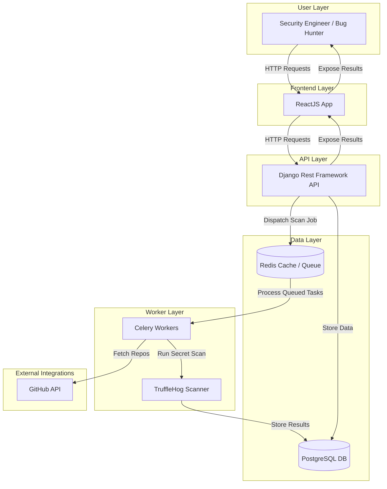

# GitAlerts Architecture

## Overview
- **API Layer** – Django REST Framework serves the user and system APIs.
- **Worker Layer** – Celery executes concurrent scan jobs (TruffleHog, GitHub API).
- **Database Layer** – PostgreSQL stores repositories, findings, and users.
- **Cache Layer** – Redis manages task queues and caching.

## System Architecture

